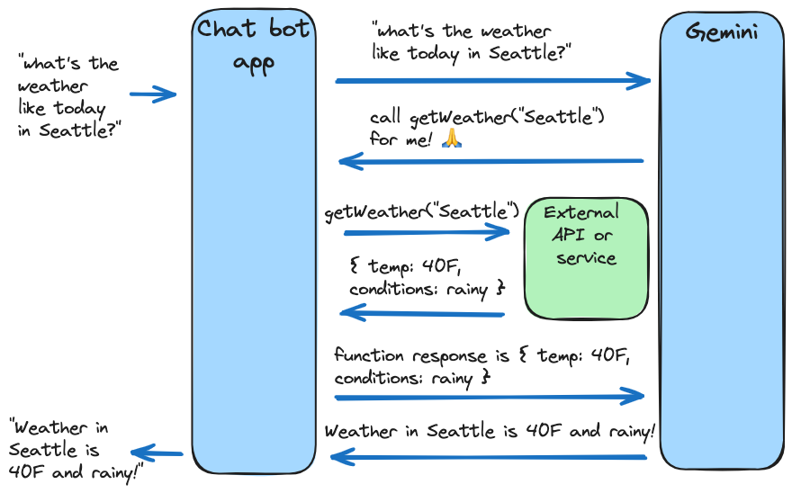

## Introduction to Function Calling in Large Language Models

Function calling is a powerful technique that significantly extends the capabilities of Large Language Models (LLMs). It allows LLMs to interact with the real world by executing external functions or APIs based on user requests. This introduction will explain what function calling is, its benefits, and how it works.

### What is Function Calling?

In essence, function calling empowers LLMs to go beyond simply generating text. Instead of just responding with words, an LLM equipped with function calling can:

1.  **Understand User Intent:**  Analyze user requests to identify the desired action or information.
2.  **Determine Necessary Function:**  Recognize if an external function or API needs to be called to fulfill the request.
3.  **Generate Function Call:** Create a structured request specifying the function to be called and the parameters required.
4.  **Execute Function (via an application):**  An external application or system then takes this function call request and executes it.
5.  **Process Results:** The results from the function call are then fed back to the LLM.
6.  **Generate Response:** Finally, the LLM uses the function call results to generate a relevant and informed response to the user.

**Think of it like this:** Imagine an LLM as a highly skilled communicator, and function calling gives it hands. These "hands" allow the LLM to reach out and interact with the world, not just talk about it.



### Benefits of Function Calling

Function calling unlocks a wide range of possibilities for LLMs, making them far more practical and useful in real-world applications. Key benefits include:

*   **Real-world Interaction:** LLMs can now interact with external APIs and services, enabling them to perform actions and access real-time data.
*   **Automation of Tasks:**  LLMs can automate tasks by calling functions to trigger workflows, control devices, or schedule events.
*   **Access to Up-to-Date Information:**  Instead of being limited to their training data, LLMs can fetch current information from APIs (e.g., weather, news, stock prices).
*   **Enhanced Accuracy and Reliability:** By relying on external, specialized tools for specific tasks, function calling can improve the accuracy and reliability of LLM responses.
*   **Building AI Agents:** Function calling is a crucial component in building more sophisticated AI agents that can not only understand language but also act upon it to achieve user goals.
*   **Customization and Integration:** Function calling allows developers to tailor LLMs to specific domains and integrate them with existing systems and workflows.

### How Function Calling Works: A Simplified Example

Let's consider a simple example of a weather application using function calling:

1.  **User Request:**  A user asks: *"What's the weather like in Lagos, Portugal?"*
2.  **Intent Recognition:** The LLM analyzes the request and understands the user wants to know the weather in a specific location.
3.  **Function Determination:** The LLM recognizes that it needs to call a weather API to get this information.
4.  **Function Call Generation:** The LLM generates a function call request, specifying something like:
    ```json
        { 
            name: 'getWeather', 
            args: { 
                country: 'PT', 
                city: 'Lagos' 
                } 
        } 
    ```
5.  **Function Execution (by application):** An application receives this request and executes the `getWeather` function, using a weather API with the location "Lagos, Portugal". The API returns weather data (e.g., temperature, conditions, humidity).
6.  **Process Results:** The application feeds the weather data back to the LLM.
7.  **Response Generation:** The LLM uses the weather data to generate a user-friendly response, such as: *"The weather in Lagos, Portugal is currently sunny with a temperature of 18 degrees Celsius."*

**In this example, the LLM didn't "know" the weather itself. Instead, it intelligently used function calling to leverage an external tool (the weather API) to get the information and provide a helpful answer.**


### How to use Function Calling with the GENAI JS SDK

To define the function calling the the Gemini SDK we need to define what is expected to the LLM know what it should call and when, for that we need to come with a function declaration:

```typescript
 const weatherFunctionDeclaration: FunctionDeclaration = {
        name: 'getWeather',
        description: 'Gets the current weather for a requested city',
        parameters: {
            type: Type.OBJECT,
            properties: {
                city: {
                    type: Type.STRING,
                    description: 'The city to get the weather information for',
                },
                country: {
                    type: Type.STRING,
                    description: 'The country of the city in country code',
                },
            },
            required: ['city', 'country'],
        },
    };
```

After define the function and the parameters the next step will be define the configuration of our chat or model:

```typescript
    const chat = await genAI.chats.create({
        model: 'gemini-2.0-flash',
        history: [],
        config: {
            tools: [{ functionDeclarations: [weatherFunctionDeclaration] }],
            toolConfig: {
                functionCallingConfig: {
                    mode: FunctionCallingConfigMode.ANY,
                    allowedFunctionNames: ['getWeather'],
                },
            },
        },
    });
```

Now anytime the model is asked about the weather it will know that has a possibility to call a function to request the realtime data.

### Use Cases for Function Calling

Function calling has a vast array of potential applications across various domains:

*   **Personal Assistants:**  Scheduling appointments, setting reminders, sending emails, making calls, controlling smart home devices.
*   **Customer Service Chatbots:**  Retrieving order information, checking product availability, processing returns, answering FAQs by accessing internal databases.
*   **Travel and Hospitality:** Booking flights and hotels, making restaurant reservations, providing local recommendations by interacting with travel APIs and databases.
*   **E-commerce:**  Searching product catalogs, retrieving pricing and inventory, processing orders, providing shipping updates.
*   **Financial Services:**  Fetching stock prices, providing market news, executing trades (with appropriate security measures).
*   **Data Analysis and Reporting:**  Querying databases, generating reports, creating visualizations based on user requests.
*   **Content Creation:**  Retrieving information to enrich articles, generate summaries, or fact-check content.

### Function Calling vs. Other Techniques

It's important to distinguish function calling from other techniques used to enhance LLMs, such as:

*   **Retrieval-Augmented Generation (RAG):** RAG focuses on augmenting the LLM's *knowledge* by retrieving information from external documents. Function calling focuses on enabling the LLM to *perform actions* and interact with external systems. While RAG enhances knowledge, function calling enhances *actionability*.
*   **Prompt Engineering:** Prompt engineering is about crafting effective prompts to guide the LLM's text generation. Function calling is a more fundamental capability that allows LLMs to go beyond text generation and interact with the real world.
